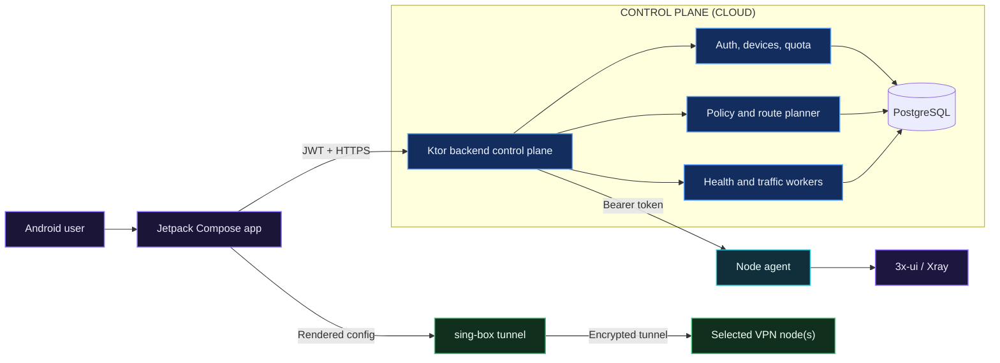

# SecureVPN Platform

[](https://kotlinlang.org/)
[](https://ktor.io/)
[](https://developer.android.com/compose)
[](https://www.docker.com/)
[](https://github.com/hoppa1231/ai-project/actions/workflows/quality.yml)

**A distributed VPN access platform that turns multi-node Xray infrastructure into a managed, quota-aware mobile product.**

SecureVPN combines an Android client, a Kotlin/Ktor control plane, PostgreSQL, and per-node provisioning agents. It handles guest onboarding, device binding, policy-driven route selection, configuration lifecycle, traffic accounting, health-aware node selection, and operator notifications.

> Despite the repository's historical name, this is currently a networking and security engineering system—not an AI wrapper. The architecture keeps deterministic policy and security decisions in code. A bounded AI-assisted operations layer is documented as a future option, not presented as an implemented feature.

## Overview

Running a VPN service is more than issuing a connection URI. Operators must keep node inventory healthy, bind access to devices, enforce quotas across rotated configurations, revoke credentials, and give clients a reliable connection workflow. SecureVPN provides that control plane while isolating vendor-specific 3x-ui operations behind a small node agent.

Primary users are:

- VPN product teams that need a mobile client and an auditable control plane;
- platform engineers managing multiple Xray/3x-ui nodes;
- interviewers evaluating Kotlin backend, Android, distributed systems, and infrastructure design.

## Problem

Directly exposing node panels to clients couples mobile releases to infrastructure details, spreads privileged credentials, and makes cross-node quota or health decisions difficult. Configuration rotation can also accidentally reset usage unless accounting is tied to the user/device rather than one generated credential.

## Solution

1. The Android app creates a guest or registered session and binds the device.
2. The control plane evaluates quota, routing policy, and live node health.
3. A short-lived client configuration is rendered for a single or cascade route.
4. The backend asks the selected node agent to provision or revoke the client in 3x-ui.
5. The Android foreground service starts sing-box and reports the actual tunnel state.
6. Health and traffic workers continuously reconcile infrastructure state with PostgreSQL.

## Features

- Guest-first onboarding, registration, login, refresh tokens, and optional Telegram authentication
- Device-bound VPN configuration issuance and revocation
- Health-aware single-hop and beta cascade route planning
- Monthly free quota plus auditable grants for registered users
- Traffic accounting that survives configuration rotation
- Runtime routing policy and GeoIP rule-set support
- Android VPN tunnel based on sing-box/libbox with explicit failure states
- Per-node 3x-ui adapter with authenticated provisioning endpoints
- Structured API errors, request correlation, rate limiting, and audit records
- Flyway migrations, OpenAPI/Swagger, Docker images, health checks, and CI

## Architecture



See [Architecture](docs/architecture.md) for trust boundaries, request flows, failure modes, and scaling notes.

## Core Components

| Component | Responsibility |
|---|---|
| `android-client/` | Compose UI, API session bootstrap, config lifecycle, and Android VPN foreground service |
| `backend/` | Canonical control plane: auth, devices, policy, quota, nodes, configuration rendering, reconciliation, and API docs |
| `node-agent/` | Narrow adapter that translates authenticated control-plane operations to the 3x-ui API |
| PostgreSQL | Durable identity, device, policy, quota, node, notification, and audit state |
| Flyway | Versioned schema evolution from a clean database to the current model |

The legacy root Gradle application is retained for compatibility. New development and production deployment use `backend/` as the canonical backend module.

## AI Architecture

No model is called in the current runtime. This is intentional: authorization, quota enforcement, credential lifecycle, and routing safety require deterministic and testable behavior.

A future AI component may summarize anonymized health/traffic signals or suggest operator actions. It must remain advisory, consume redacted structured telemetry, use schema-constrained output, and require deterministic validation and operator approval before any mutation. Prompts, evaluation criteria, and data boundaries are described in [Design Decisions](docs/design-decisions.md#ai-boundary).

## Technical Decisions

- **Kotlin + Ktor:** one strongly typed language across backend and node agent, with coroutines and a small HTTP stack.
- **PostgreSQL + Flyway:** transactional state and reviewable, repeatable migrations.
- **Modular monolith control plane:** simpler transactional consistency today, with clear route/repository boundaries for later extraction.
- **Node-side adapter:** panel credentials stay on VPN nodes; the control plane uses a narrow authenticated contract.
- **Server-rendered configuration:** policy remains centrally controlled and mobile clients do not encode infrastructure topology.
- **AI outside the security path:** probabilistic output cannot grant access, change quota, or provision credentials.

The complete rationale and trade-offs are in [Design Decisions](docs/design-decisions.md).

## Tech Stack

| Area | Technologies |
|---|---|
| Backend | Kotlin 2.3, Ktor 3.4, kotlinx.serialization, jOOQ |
| Android | Kotlin, Jetpack Compose, Material 3, libbox/sing-box |
| Security | JWT, Argon2, device binding, bearer-authenticated node API, Bucket4j |
| Data | PostgreSQL 16, HikariCP, Flyway |
| Infrastructure | Docker, Docker Compose, GitHub Actions, multi-stage JVM images |
| Testing | Kotlin Test/JUnit, Ktor test host, Android local unit tests |

## Installation

Prerequisites: Docker with Compose, or JDK 21 when running the backend directly.

```bash
git clone https://github.com/hoppa1231/ai-project.git
cd ai-project
cp .env.example .env
docker compose up --build
```

Wait for PostgreSQL and the API, then verify:

```bash
curl --fail http://localhost:8080/health
curl --fail http://localhost:8080/openapi.json
```

For local backend development:

```bash
docker compose up -d postgres
cd backend
bash ./gradlew clean test
bash ./gradlew run
```

Never reuse the example secrets outside local development. Node-agent and Android setup are documented in their respective directories.

## Usage

Create a guest session:

```bash
curl --request POST http://localhost:8080/auth/guest \
  --header 'Content-Type: application/json' \
  --data '{"deviceFingerprint":"demo-device-001","deviceName":"Pixel development device","platform":"android","appVersion":"1.0"}'
```

Interactive API documentation is available at `http://localhost:8080/swagger`. A typical end-to-end demo is:

```text
guest session -> device bind -> healthy nodes -> quota check
              -> issue config -> start tunnel -> account traffic -> revoke config
```

API responses and schemas are defined by `backend/src/main/resources/openapi/openapi.json`.

## Project Structure

```text
.
├── android-client/       # Mobile UI and sing-box VPN runtime
├── backend/              # Canonical Ktor control plane and migrations
├── node-agent/           # 3x-ui provisioning adapter deployed per node
├── docs/                 # Architecture, decisions, roadmap, interview guide
├── .github/workflows/    # Validation and controlled deployment pipelines
├── docker-compose.yml    # Local PostgreSQL + backend environment
├── Makefile              # Repeatable developer commands
└── src/                  # Legacy root backend retained for compatibility
```

## Demo and Screenshots

The Android app provides the visual demo: onboarding, server selection, quota and notifications, swipe-to-connect interaction, live connection state, and a persistent VPN notification. Repository screenshots are a roadmap item because they should be captured from a reproducible emulator build rather than represented by mock content.

## Quality Checks

```bash
make test              # backend + node agent + Android unit tests
make backend-test
make agent-test
make android-test
make compose-validate
```

## Future Roadmap

- Integration tests with PostgreSQL/Testcontainers and a fake node-agent contract
- Metrics, traces, SLOs, dashboards, and alerting
- Release signing and secret-manager-backed deployment
- Horizontal worker coordination and idempotent provisioning jobs
- Advisory AI operations assistant with redaction, evaluations, and approval gates
- Reproducible emulator screenshots and a recorded end-to-end demo

See [Roadmap](docs/roadmap.md) for prioritized milestones and explicit production gaps. For interview preparation, use [Interview Guide](docs/interview.md).
