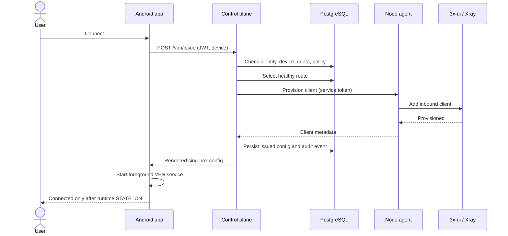

# Architecture

## System context

SecureVPN separates the public product API from infrastructure-specific node management. The Android app trusts one control-plane API. The control plane owns identity, policy, quota, and configuration lifecycle. A private agent on each VPN node owns the local 3x-ui credential and exposes only the operations required by the platform.

## Trust boundaries

| Boundary | Controls |
|---|---|
| Mobile to control plane | HTTPS, access JWT, refresh-token rotation, device fingerprint |
| Control plane to PostgreSQL | Private connection, least-privilege database user, Flyway-managed schema |
| Control plane to node agent | Network restriction plus shared bearer token; production should use mTLS |
| Node agent to 3x-ui | Loopback/private access; panel credentials never leave the node |
| Config to tunnel runtime | Short lifecycle, explicit revoke path, state confirmed by sing-box callbacks |

## Backend module boundaries

- `modules/auth`: guest/registered identity, login and Telegram authentication.
- `modules/devices`: device binding and access ownership.
- `modules/nodes` and `modules/health`: inventory, health snapshots, background reconciliation.
- `modules/policy`: versioned route policy and deterministic hashing.
- `modules/vpn`: route planning, config rendering, issue/revoke orchestration.
- `modules/quota`: monthly allowance, grants, and usage aggregation.
- `db/repo`: SQL persistence interfaces grouped by aggregate.
- `agent` and `xray`: infrastructure adapter boundary.

## Failure behavior

- No healthy eligible node: fail closed with a domain error; do not issue an unusable config.
- Node provisioning timeout/failure: do not report the VPN as connected; keep an auditable failure.
- Cascade partial failure: use single-hop only when policy explicitly permits fallback.
- Mobile tunnel startup failure: expose the sing-box error and stop after a bounded timeout.
- Duplicate/retried requests: the target design is idempotent provisioning; this remains a roadmap gap.
- Health worker failure: retain the last state but expose staleness; production metrics are still required.

## Scaling path

The control plane is a modular monolith because identity, quota, config lifecycle, and audit writes benefit from local transactions. It can scale horizontally after moving background work to coordinated jobs and making provisioning idempotent. PostgreSQL remains the source of truth; read-heavy node/status endpoints can gain caching only after invalidation semantics are defined.
